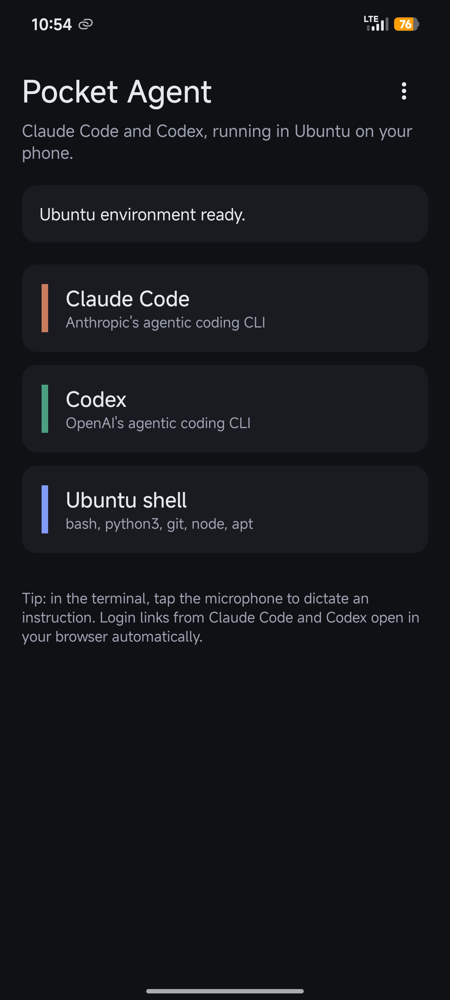
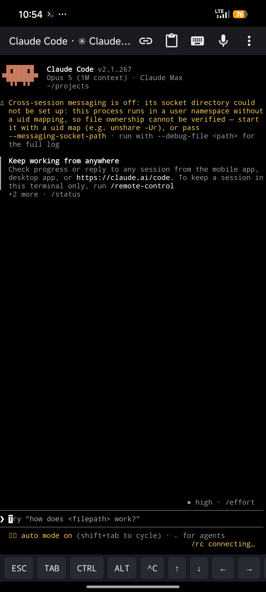
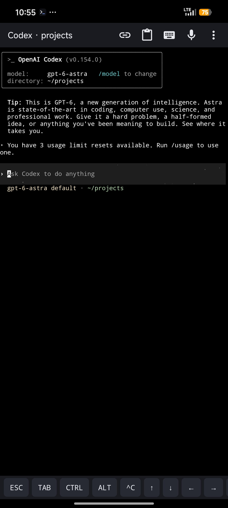
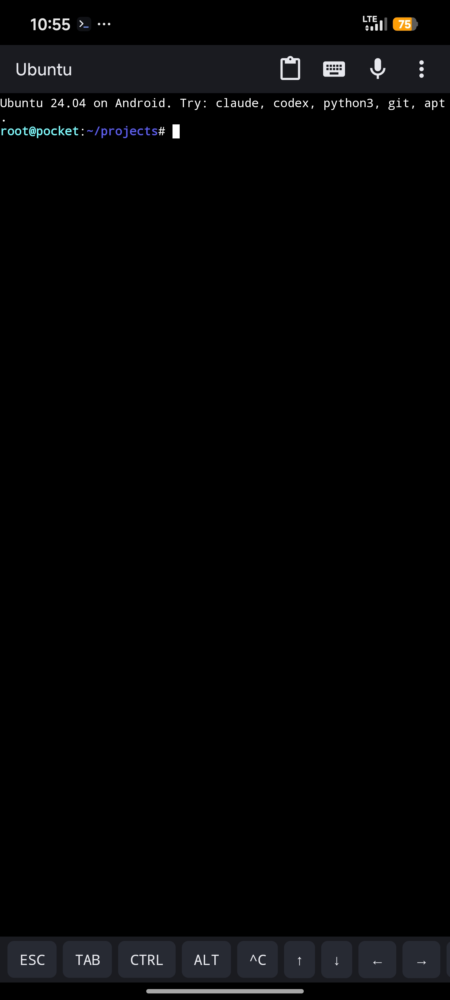

  

  <strong align="center">Your coding agent, in your pocket. No computer needed!</strong>

  

  Direct download: <a href="https://github.com/HangYu8123/Pocket-CLI/raw/main/Pocket-CLI.apk">github.com/HangYu8123/Pocket-CLI/raw/main/Pocket-CLI.apk</a>

  
  
  

  
  
  
  

Real screenshots from a Xiaomi 13 Ultra.

## Install

1. [Download `Pocket-CLI.apk`](https://github.com/HangYu8123/Pocket-CLI/raw/main/Pocket-CLI.apk) on your phone, open it → **Install** (choose *Install anyway* if Android warns).
2. Open Pocket-CLI → **Install Ubuntu environment**. One tap; 5–15 minutes; runs in the background.
3. Tap **Claude Code** or **Codex** → sign in when the browser opens → start talking.

Or 🔗 [build it yourself](docs/DEVELOPMENT.md).

## What it does

Runs the real **Claude Code** and **Codex** CLIs on your Android phone, inside a real Ubuntu.
Speak or type. The agent writes the code, runs it, fixes it. Your laptop stays off.

## What changes

<table>
<tr>
<td width="50%">

## Before

> Idea on the train. Open notes app. Type a reminder. Get home. Boot the laptop. Wait for updates. Open the terminal. Remember what the idea was. Try to recreate it. It's 11pm.

</td>

<td width="50%">

## After

> Idea on the train. Open Pocket-CLI. Tap the mic.
>
> 1. "Write a script that pulls my calendar and finds free evenings."
> 2. Claude Code writes it, runs it, shows the output.
> 3. Say "make it a weekly summary." Done.
>
> Next: it's still 9am. You're still on the train.

</td>
</tr>
</table>

## How to use

7 things to know. Everything else works like the desktop CLI.

1. **Home screen** — Claude Code, Codex, Ubuntu shell. A *running* badge means the session is still alive; tap to jump back in.
2. **Mic button** — tap, speak, Enter. Long-press to pick the engine: phone speech service, offline Whisper (built in, no Google), or your keyboard's mic key.
3. **Working folder** — where agents start. **New folder…** creates one inside Ubuntu or on phone storage and selects it.
4. **Extra keys** — ESC, TAB, CTRL, ALT, ^C, arrows under the terminal. CTRL is sticky: tap it, then a letter.
5. **Links** — login pages open in your browser by themselves. The 🔗 icon re-opens the last one.
6. **Background** — sessions keep running while you switch apps. Keep the notification on.
7. **Python** — `python`, `pip install x`, `apt install y` all work in the Ubuntu shell. Everything stays installed.

## Tune it

Settings live under **⋮** on the home screen.

| Want | Do |
| --- | --- |
| Bigger text | Pinch the terminal, or terminal menu → *Font size* |
| Send dictation without pressing Enter | *Dictation → Send after dictation* |
| Chinese (or other) dictation | *Dictation → Dictation language* |
| Better offline transcription | *Dictation → Whisper model → Small* (190 MB) |
| Files visible to other apps | *Allow access to phone storage*, then use a *Phone ·* folder |
| Newer Claude Code / Codex | *Update Claude Code and Codex* |
| Phone kills the agent overnight | Battery → *No restrictions*; on Xiaomi also *Autostart* + lock in Recents |
| Fresh start | *Reinstall Ubuntu environment* |

Mic silent? *Settings → Voice input not working?* tells you which engines your phone has and switches you to offline Whisper.

## Credits

Standing on: [proot](https://github.com/termux/proot) and the [Termux](https://termux.dev) terminal
engine, [Ubuntu](https://ubuntu.com) 24.04, [whisper.cpp](https://github.com/ggml-org/whisper.cpp),
and of course [Claude Code](https://claude.com/claude-code) by Anthropic and
[Codex](https://openai.com/codex) by OpenAI, each of which needs your own account.

How it all fits together: [docs/DEVELOPMENT.md](docs/DEVELOPMENT.md).

## License

[MIT](LICENSE) for Pocket-CLI's own code. Bundled components keep their own licenses.

⭐ Star it if it ever let you leave the laptop at home.
